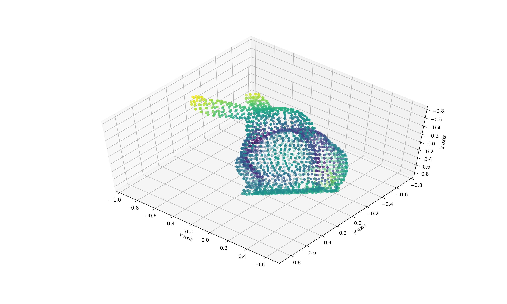
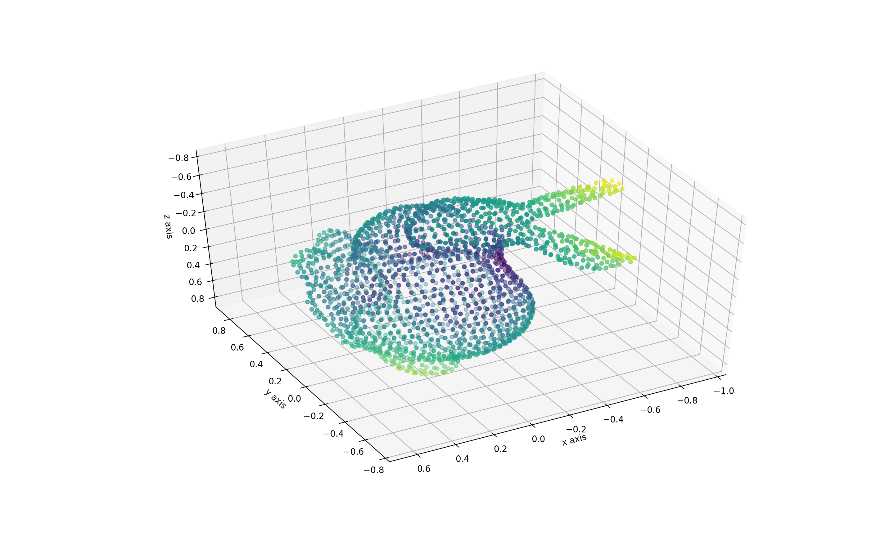
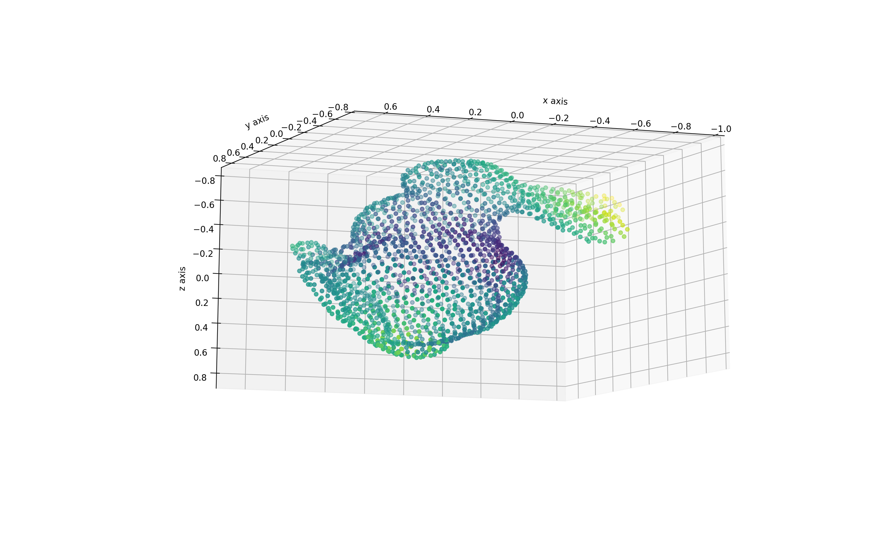
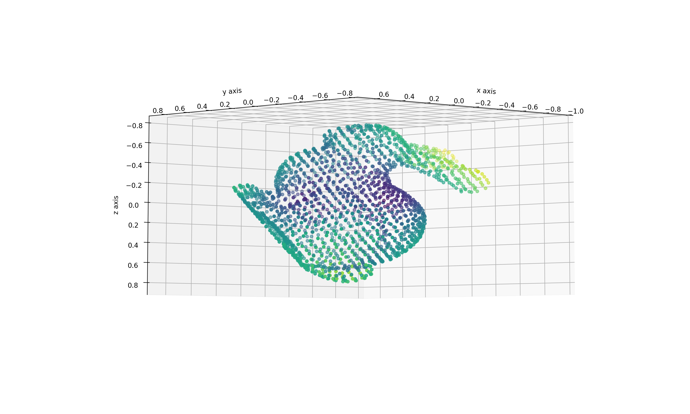

# Implementation of Tomasi-Kanade method

## Demo

Tomasi-Kanadde method can reconstruct a 3D object from 2D observations.

For example, from the 2D points like below...

|  |  |
|:-----------------------------------------------------|:-----------------------------------------------------|
|  |  |

Tomasi-Kanadde method can reconstruct the 3D object.

|  |  |
|:-------------------------------------------------------|:-------------------------------------------------------|
|  |  |

## Install dependencies

```
pip3 install -r requirements.txt
```

## Run reconstruction

Download and extract the dataset

```
wget -c http://graphics.stanford.edu/pub/3Dscanrep/bunny.tar.gz
tar xvf bunny.tar.gz
```

Run reconstruction 

```
python3 run_reconstruction.py bunny/reconstruction/bun_zipper_res4.ply
```

## Documentation

Documentation can be generated by running `make html` in the `docs` directory.

## Citation

```
[1] Carlo Tomasi and Takeo Kanade. 
"Shape and motion from image streams under orthography: a factorization method." 
International Journal of Computer Vision 9.2 (1992): 137-154.
```

```
[2] Timo Zinßer, Jochen Schmidt, and Heinrich Niemann. 
"Point set registration with integrated scale estimation." 
International conference on pattern recognition and image processing. 2005.
```
